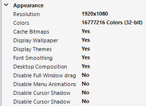

# Настройка фонового фарма

Фоновый фарм позволит Вам заниматься своими делами на Вашем ПК, пока панель фармит аккаунты.

В данный момент алгоритм действий полностью идентичен гайду из [FSM panel](https://fsmpanel.gitbook.io/guide/dopolnitelnye-neobyazatelnye-nastroiki-fsm-panel/nastroika-fonovogo-farma-fsm-panel-opcionalno), так что можете смело следовать ему.&#x20;

### Дополнительные настройки Windows 11

Если Вы используете Windows 11 или более новую версию [mRemoteNG](https://github.com/mRemoteNG/mRemoteNG/releases/tag/20251021-v1.78.2-NB-\(3228\)), возможно понадобится настроить отрисовку, чтобы улучшить распознавание панелью некоторых элементов. Также рекомендуется использовать конкретное разрешение, желательно 1920x1080 и более.&#x20;

<figure><figcaption></figcaption></figure>
